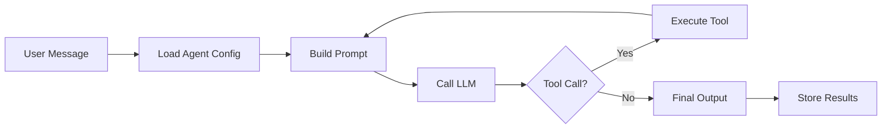

## What is an Agent?

An agent is an autonomous AI entity powered by a large language model. When you send a message to an agent, it:

1. **Reasons** about the task using its behavior prompt and conversation history
2. **Calls tools** if needed (built-in functions, integrations, or other agents)
3. **Iterates** until it has a final answer or reaches the step limit
4. **Returns** a final output with full execution trace

## Agent lifecycle

## Agent statuses

| Status | Description |
|--------|-------------|
| **Active** | Agent is available for execution |
| **Inactive** | Agent is disabled — cannot be run |
| **Archived** | Agent is soft-deleted |

## Run statuses

| Status | Description |
|--------|-------------|
| **Pending** | Run created, waiting for execution |
| **Running** | Agent is actively processing |
| **Completed** | Agent finished successfully |
| **Failed** | Execution encountered an error |
| **Cancelled** | Run was cancelled by user or system |

## Quality assurance

When enabled, a **QualityChecker** system agent evaluates each run's output:

- **Quality Score** — 0.0 to 1.0 rating
- **Verdict** — `pass`, `warn`, or `fail`
- **Reasoning** — explanation of the assessment
- **Issues** — specific problems found (if any)

Runs that fail quality checks can be automatically retried.
