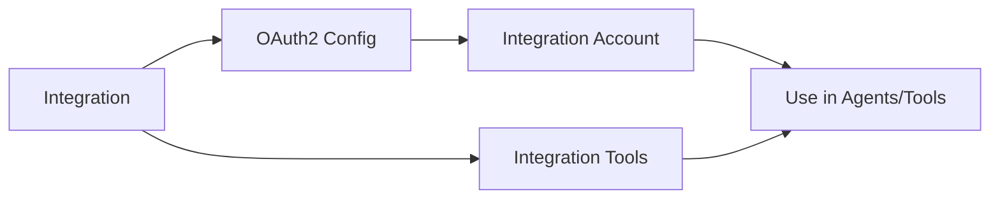

## What are Integrations?

Integrations connect Flowyble to external services — Google, Microsoft, Slack, and more. Once connected, you can use **integration tools** in your agents and workflows to interact with these services.

## Architecture

| Component | Description |
|-----------|-------------|
| **Integration** | Platform-level definition of an external service |
| **OAuth2 Configuration** | Authentication setup (client ID, scopes, endpoints) |
| **Integration Account** | Organization-level stored credentials |
| **Integration Tools** | Pre-built functions for the service |

## Available integrations

Integrations are managed at the platform level and made available to all organizations. Check the **Integrations** page in your dashboard for the current list.

## Connecting an integration

<Steps>
  <Step title="Browse integrations">
    Go to **Integrations** and find the service you want to connect.
  </Step>
  <Step title="Authenticate">
    Click **Connect** to start the OAuth2 flow. You'll be redirected to the service to grant access.
  </Step>
  <Step title="Use">
    Once connected, the integration's tools become available in your agents and tool builder.
  </Step>
</Steps>

## Integration accounts

Each organization maintains its own integration accounts. Credentials are stored securely and scoped to your organization — other tenants cannot access them.

Multiple team members can use the same integration account, or you can connect multiple accounts for the same service.
